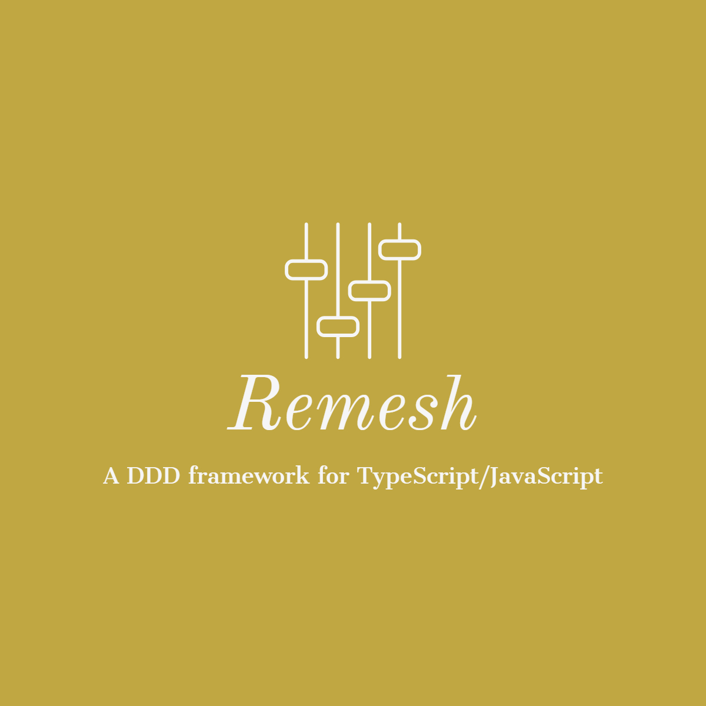

# remesh

<p align="center">
  
</p>

[](https://www.npmjs.com/package/remesh)
[](https://github.com/Lucifier129/remesh#readme)
[](https://github.com/Lucifier129/remesh/graphs/commit-activity)
[](https://github.com/Lucifier129/remesh/blob/master/LICENSE)
[](https://twitter.com/guyingjie129)

> A DDD framework for large and complex TypeScript/JavaScript applications

## Features

- DDD principles
- CQRS Architecture
- Event-driven Architecture
- Incremental updates
- Reactive programming
- Immutable state
- Type-friendly APIs
- Framework-agnostic(React/Vue supported officially)
- SSR support

## Concepts

A domain is like a component of your application. But not for the UIs, it's for your business logic.

All related things are encapsuled in the domain.

A domain can have as many resources listed in below as you want.

- **Domain States**: the state you want to store in the domain.
- **Domain Entities**: the entity you want to store in the domain. An entity must has a unique identifier as key.
- **Domain Events**: identify something happened in the domain.
- **Domain Commands**: update states/entities or emit events or do nothing.
- **Domain Queries**: query states/entities or deriving another query.
- **Domain Effects**: An observable that perform side-effect and send commands or events.

For any domains, only `domain-query`, `domain-command`, `domain-event` can be exposed to the outside.

`domain-state` and `domain-entity` are not exposed to the outside and can't be touched directly out of the domain.

For the consumers of any domains.

- The only way to read states or entities is through `domain-query` for preventing invalid read.

- The only way to update states or entities is through `domain-command` for preventing invalid update.

## Installation

```sh
# Install remesh and rxjs via npm
npm install --save remesh rxjs
# Install remesh and rxjs via yarn
yarn add remesh rxjs
```

## Usage

You can edit it in [stackblitz](https://stackblitz.com/edit/react-ts-gg1icr?file=domain.ts,index.tsx)

### define your domain

```typescript
import { Remesh } from 'remesh'

import { interval } from 'rxjs'
import { map, switchMap, takeUntil } from 'rxjs/operators'

type ChangeMode = 'increment' | 'decrement'

/**
 * Define your domain model
 */
export const CountDomain = Remesh.domain({
  name: 'CountDomain',
  impl: (domain) => {
    /**
     * Define your domain's related states
     */
    const CountState = domain.state({
      name: 'CountState',
      default: 0,
    })

    /**
     * Define your domain's related events
     */
    const CountChangedEvent = domain.event<number>({
      name: 'CountChangedEvent',
    })

    /**
     * Define your domain's related commands
     */
    const SetCountCommand = domain.command({
      name: 'SetCountCommand',
      impl: ({}, count: number) => {
        /**
         * Update the domain's state and emit the related event
         */
        return [CountState().new(count), CountChangedEvent(count)]
      },
    })

    /**
     * Define your domain's related queries
     */
    const CountQuery = domain.query({
      name: 'CountQuery',
      impl: ({ get }) => {
        /**
         * Get the domain's state
         */
        return get(CountState())
      },
    })

    /**
     * You can use a command in another command
     */
    const IncreaseCountCommand = domain.command({
      name: 'IncreaseCountCommand',
      impl: ({ get }, count: number = 1) => {
        return SetCountCommand(get(CountState()) + count)
      },
    })

    /**
     * You can use a command in another command
     */
    const DecreaseCountCommand = domain.command({
      name: 'IncreaseCountCommand',
      impl: ({ get }, count: number = 1) => {
        return SetCountCommand(get(CountState()) - count)
      },
    })

    const ChangeCountByModeCommand = domain.command({
      name: 'ChangeCountByModeCommand',
      impl: ({}, mode: ChangeMode) => {
        if (mode === 'increment') return IncreaseCountCommand()
        if (mode === 'decrement') return DecreaseCountCommand()
        return null
      },
    })

    /**
     * Define an event for starting increment or decrement periodically
     */
    const StartEvent = domain.event<ChangeMode>({
      name: 'StartEvent',
    })

    /**
     * Define an event for stopping signal
     */
    const StopEvent = domain.event({
      name: 'StopEvent',
    })

    /**
     * Define your domain's related effects
     */

    domain.effect({
      name: 'ChangeCountEffect',
      impl: ({ fromEvent }) => {
        return fromEvent(StartEvent).pipe(
          switchMap((mode) => {
            return interval(100).pipe(
              map(() => ChangeCountByModeCommand(mode)),
              // finished when received stop event
              takeUntil(fromEvent(StopEvent)),
            )
          }),
        )
      },
    })

    /**
     * Expose domain resources
     */
    return {
      query: {
        CountQuery,
      },
      command: {
        SetCountCommand,
        IncreaseCountCommand,
        DecreaseCountCommand,
      },
      event: {
        StartEvent,
        StopEvent,
        /**
         * You can make an event subscribe-only for the consumers outside of domain
         */
        CountChangedEvent: CountChangedEvent.toSubscribeOnlyEvent(),
      },
    }
  },
})
```

### Using your domain in react component

```jsx
import { StrictMode } from 'react'
import { createRoot } from 'react-dom/client'

import * as React from 'react'

import { RemeshRoot, useRemeshDomain, useRemeshQuery, useRemeshSend, useRemeshEvent } from 'remesh-react'

import { CountDomain } from './domain'

export const Counter = () => {
  /**
   * use remesh send for sending commands
   */
  const send = useRemeshSend()

  /**
   * read domain via useRemeshDomain
   */
  const countDomain = useRemeshDomain(CountDomain())

  /**
   * read domain query via useRemeshQuery
   */
  const count = useRemeshQuery(countDomain.query.CountQuery())

  const handleIncrement = () => {
    /**
     * send command to domain
     */
    send(countDomain.command.IncreaseCountCommand())
  }

  const handleDecrement = () => {
    /**
     * send command to domain
     */
    send(countDomain.command.DecreaseCountCommand())
  }

  const handleStartIncrease = () => {
    /**
     * send event to domain
     */
    send(countDomain.event.StartEvent('increment'))
  }

  const handleStartDecrease = () => {
    /**
     * send event to domain
     */
    send(countDomain.event.StartEvent('decrement'))
  }

  const handleStop = () => {
    /**
     * send event to domain
     */
    send(countDomain.event.StopEvent())
  }

  /**
   * listen to the domain event via useRemeshEvent
   */
  useRemeshEvent(countDomain.event.CountChangedEvent, (count) => {
    console.log(count)
  })

  return (
    <div id="container" style={{ textAlign: 'center', fontSize: 28 }}>
      <h1 id="count">{count}</h1>
      <button style={{ height: 40 }} onClick={handleStartIncrease}>
        start increase
      </button> <button style={{ height: 40 }} onClick={handleIncrement}>
        +1
      </button> <button style={{ height: 40 }} onClick={handleStop}>
        stop
      </button> <button style={{ height: 40 }} onClick={handleDecrement}>
        -1
      </button> <button style={{ height: 40 }} onClick={handleStartDecrease}>
        start decrease
      </button>{' '}
    </div>
  )
}

const rootElement = document.getElementById('root')
const root = createRoot(rootElement)

root.render(
  <StrictMode>
    <RemeshRoot>
      <Counter />
    </RemeshRoot>
  </StrictMode>,
)
```

## Recipes

- [How to define a domain?](#how-to-define-a-domain)
- [How to define a state?](#how-to-define-a-state)
- [How to define a command?](#how-to-define-a-command)
- [How to read the state in command?](#how-to-read-the-state-in-command)
- [How to define a query?](#how-to-define-a-query)
- [How to update the state?](#how-to-update-the-state)
- [How to define an event?](#how-to-define-an-event)
- [How to emit an event in command?](#how-to-emit-an-event-in-command)
- [How to update multiple states?](#how-to-update-multiple-states)
- [How not to do anything in command?](#how-not-to-do-anything-in-command)
- [How to pass arg to domain query?](#how-to-pass-arg-to-domain-query)
- [How to pass arg to domain command?](#how-to-pass-arg-to-domain-command)
- [How to define an effect?](#how-to-define-an-effect)
- [How to define an entity?](#how-to-define-an-entity)
- [How to use domain in react component?](#how-to-use-domain-in-react-component)
- [How to pass a remesh store to react component?](#how-to-pass-a-remesh-store-to-react-component)
- [How to attach logger?](#how-to-attach-logger)
- [How to connect redux-devtools?](#how-to-connect-redux-devtools)
- [How to fetch async resources in domain?](#how-to-fetch-async-resources-in-domain)
- [How to manage a list in domain?](#how-to-manage-a-list-in-domain)
- [How to define a custom module for reusing logic between domains?](#how-to-define-a-custom-module-for-reusing-logic-between-domains)
- [How to access other domains?](#how-to-access-other-domains)
- [How to subscribe to events or queries or commands in domain-effect?](#how-to-subscribe-to-events-or-queries-or-commands-in-domain-effect)
- [How to create and use remesh store directly?](#how-to-create-and-use-remesh-store-directly)

### How to define a domain?

```typescript
import { Remesh } from 'remesh'

const YourDomain = Remesh.domain({
  name: 'YourDomain',
  impl: (domain) => {
    // define your domain's related resources
  },
})
```

### How to define a state?

```typescript
import { Remesh } from 'remesh'

const YourDomain = Remesh.domain({
  name: 'YourDomain',
  impl: (domain) => {
    const YourState = domain.state({
      name: 'YourState',
      default: 0,
    })
  },
})
```

### How to define a command?

```typescript
import { Remesh } from 'remesh'

const YourDomain = Remesh.domain({
  name: 'YourDomain',
  impl: (domain) => {
    const YourCommand = domain.command({
      name: 'YourCommand',
      impl: ({ get }) => {
        // do something
      },
    })
  },
})
```

### How to read the state in command?

```typescript
import { Remesh } from 'remesh'

const YourDomain = Remesh.domain({
  name: 'YourDomain',
  impl: (domain) => {
    const YourState = domain.state({
      name: 'YourState',
      default: 0,
    })

    const YourCommand = domain.command({
      name: 'YourCommand',
      impl: ({ get }, ...args) => {
        const state = get(YourState())
      },
    })
  },
})
```

### How to update the state?

```typescript
import { Remesh } from 'remesh'

const YourDomain = Remesh.domain({
  name: 'YourDomain',
  impl: (domain) => {
    const YourState = domain.state({
      name: 'YourState',
      default: 0,
    })

    const YourCommand = domain.command({
      name: 'YourCommand',
      impl: ({ get }, ...args) => {
        return YourState().new(get(YourState()) + 1)
      },
    })
  },
})
```

### How to define a query?

```typescript
import { Remesh } from 'remesh'

const YourDomain = Remesh.domain({
  name: 'YourDomain',
  impl: (domain) => {
    const YourQuery = domain.query({
      name: 'YourQuery',
      impl: ({ get }) => {
        // do something
      },
    })
  },
})
```

### How to define an event?

```typescript
import { Remesh } from 'remesh'

const YourDomain = Remesh.domain({
  name: 'YourDomain',
  impl: (domain) => {
    const YourEvent = domain.event({
      name: 'YourEvent',
    })
  },
})
```

### How to emit an event in command?

```typescript
import { Remesh } from 'remesh'

const YourDomain = Remesh.domain({
  name: 'YourDomain',
  impl: (domain) => {
    const YourEvent = domain.event<number>({
      name: 'YourEvent',
    })

    const YourCommand = domain.command({
      name: 'YourCommand',
      impl: ({ get }) => {
        // just return an event in command
        return YourEvent(42)
      },
    })
  },
})
```

### How to update multiple states?

```typescript
import { Remesh } from 'remesh'

const YourDomain = Remesh.domain({
  name: 'YourDomain',
  impl: (domain) => {
    const AState = domain.state({
      name: 'AState',
      default: 0,
    })

    const BState = domain.state({
      name: 'BState',
      default: 0,
    })

    const CEvent = domain.event<number>({
      name: 'CEvent',
    })

    const YourCommand = domain.command({
      name: 'YourCommand',
      impl: ({ get }) => {
        // return a list
        return [AState().new(get(AState()) + 1), BState().new(get(BState()) + 1), CEvent(42)]
      },
    })
  },
})
```

### How not to do anything in command?

```typescript
import { Remesh } from 'remesh'

const YourDomain = Remesh.domain({
  name: 'YourDomain',
  impl: (domain) => {
    const YourCommand = domain.command({
      name: 'YourCommand',
      impl: () => {
        return null
      },
    })
  },
})
```

### How to pass arg to domain query?

```typescript
import { Remesh } from 'remesh'

const YourDomain = Remesh.domain({
  name: 'YourDomain',
  impl: (domain) => {
    const YourQuery = domain.query({
      name: 'YourQuery',
      impl: ({ get }, arg: number) => {
        // do something
      },
    })
  },
})
```

### How to pass arg to domain command?

```typescript
import { Remesh } from 'remesh'

const YourDomain = Remesh.domain({
  name: 'YourDomain',
  impl: (domain) => {
    const YourCommand = domain.command({
      name: 'YourCommand',
      impl: ({ get }, arg: number) => {
        // do something
      },
    })
  },
})
```

### How to define an effect?

```typescript
import { Remesh } from 'remesh'

// import rxjs for domain effect management
import { interval } from 'rxjs'

import { map } from 'rxjs/operators'

const YourDomain = Remesh.domain({
  name: 'YourDomain',
  impl: (domain) => {
    const YourEffect = domain.effect({
      name: 'YourEffect',
      impl: ({ get }) => {
        // send command to downstream
        return interval().pipe(map(() => YourCommand()))
      },
    })
  },
})
```

### How to define an entity?

```typescript
import { Remesh } from 'remesh'

type Todo = {
  id: number
  title: string
  completed: boolean
}

const YourDomain = Remesh.domain({
  name: 'YourDomain',
  impl: (domain) => {
    /**
     * Every entity should has a unique key
     */
    const YourEntity = domain.entity<Todo>({
      name: 'YourEntity',
      key: (todo) => todo.id.toString(),
    })
  },
})
```

### How to use domain in react component?

```sh
# via npm
npm install --save remesh-react

# via yarn
yarn add remesh-react
```

For `react v18`

```tsx
import React from 'react'
import ReactDOM from 'react-dom/client'
import { RemeshRoot, useRemeshDomain, useRemeshQuery, useRemeshEvent, useRemeshSend } from 'remesh-react'

const YourComponent = () => {
  const send = useRemeshSend()
  const domain = useRemeshDomain(YourDomain())
  const data = useRemeshQuery(domain.query.YourQuery(queryArg))

  const handleClick = () => {
    send(domain.command.YourCommand(commandArg))
  }

  useRemeshEvent(domain.event.YourEvent, (event) => {
    // do something
  })

  return <></>
}

const root = ReactDOM.createRoot(document.getElementById('root'))

root.render(
  <RemeshRoot>
    <YourComponent />
  </RemeshRoot>,
)
```

### How to pass a remesh store to react component?

```tsx
const root = ReactDOM.createRoot(document.getElementById('root'))

const store = Remesh.store()

root.render(
  <RemeshRoot store={store}>
    <YourComponent />
  </RemeshRoot>,
)
```

### How to attach logger?

```sh
# via npm
npm install --save remesh-logger

# via yarn
yarn add remesh-logger
```

```tsx
import { RemeshLogger } from 'remesh-logger'

const store = Remesh.store({
  inspectors: [RemeshLogger()],
})

root.render(
  <RemeshRoot store={store}>
    <YourComponent />
  </RemeshRoot>,
)
```

### How to connect redux-devtools?

```sh
# via npm
npm install --save remesh-redux-devtools

# via yarn
yarn add remesh-redux-devtools
```

```tsx
import { RemeshReduxDevtools } from 'remesh-redux-devtools'

const store = Remesh.store({
  inspectors: [RemeshReduxDevtools()],
})

root.render(
  <RemeshRoot store={store}>
    <YourComponent />
  </RemeshRoot>,
)
```

### How to fetch async resources in domain?

```typescript
import { Remesh } from 'remesh'
import { AsyncModule } from 'remesh/modules/async'

const YourDomain = Remesh.domain({
  name: 'YourDomain',
  impl: (domain) => {
    const YourAsyncTask = AsyncModule(domain, {
      name: 'YourAsyncTask',
      load: async ({ get }, arg: number) => {
        const response = fetch('/path/to/api?arg=' + arg)
        const json = await response.json()
        return json
      },
      onSuccess: (json) => {
        return MySuccessCommand(json)
      },
      onFailed: (error) => {
        return MyFailedCommand(error.message)
      },
      onLoading: () => {
        return MyLoadingCommand()
      },
      onCanceled: () => {
        return MyCanceledCommand()
      },
      onChanged: () => {
        return MyChangedCommand()
      },
    })

    return {
      command: {
        LoadCommand: YourAsyncTask.command.LoadCommand,
        CanceledCommand: YourAsyncTask.command.CanceledCommand,
        ReloadCommand: YourAsyncTask.command.ReloadCommand,
      },
      event: {
        SuccessEvent: YourAsyncTask.event.SuccessEvent,
        FailedEvent: YourAsyncTask.event.FailedEvent,
        LoadingEvent: YourAsyncTask.event.LoadingEvent,
        CanceledEvent: YourAsyncTask.event.CanceledEvent,
        ChangedEvent: YourAsyncTask.event.ChangedEvent,
      },
    }
  },
})
```

### How to manage a list in domain?

```typescript
import { Remesh } from 'remesh'
import { ListModule } from 'remesh/modules/list'

type Todo = {
  id: number
  title: string
  completed: boolean
}

const TodoListDomain = Remesh.domain({
  name: 'TodoListDomain',
  impl: (domain) => {
    const TodoList = ListModule(domain, {
      name: 'TodoList',
      key: (todo) => todo.id.toString(),
    })

    return {
      command: {
        AddItemCommand: TodoList.command.AddItemCommand,
        DeleteItemCommand: TodoList.command.DeleteItemCommand,
        UpdateItemCommand: TodoList.command.UpdateItemCommand,
        AddItemListCommand: TodoList.command.AddItemListCommand,
        DeleteItemListCommand: TodoList.command.DeleteItemListCommand,
        UpdateItemListCommand: TodoList.command.UpdateItemListCommand,
        InsertBeforeCommand: TodoList.command.InsertBeforeCommand,
        InsertAfterCommand: TodoList.command.InsertAfterCommand,
        InsertAtCommand: TodoList.command.InsertAtCommand,
      },
    }
  },
})
```

### How to define a custom module for reusing logic between domains?

```typescript
import { Remesh, RemeshDomainContext, Capitalize } from 'Remesh'

/**
 * Capitalize is a helper type to constraint the name should start with upper case.
 */
export type TextModuleOptions = {
  name: Capitalize
  default?: string
}

/**
 * TextModule is a module for text.
 * Receiving a domain as fixed argument, you can use it in any domain by passing domain as argument.
 * The second argument is your custom options.
 */
export const TextModule = (domain: RemeshDomainContext, options: TextModuleOptions) => {
  const TextState = domain.state({
    name: `${options.name}.TextState`,
    default: options.default ?? '',
  })

  const TextQuery = domain.query({
    name: `${options.name}.TextQuery`,
    impl: ({ get }) => get(TextState()),
  })

  const SetTextCommand = domain.command({
    name: `${options.name}.SetTextCommand`,
    impl: ({}, current: string) => {
      return TextState().new(current)
    },
  })

  const ClearTextCommand = domain.command({
    name: `${options.name}.ClearTextCommand`,
    impl: ({}) => {
      return TextState().new('')
    },
  })

  const ResetCommand = domain.command({
    name: `${options.name}.ResetCommand`,
    impl: ({}) => {
      return TextState().new(options.default ?? '')
    },
  })

  return Remesh.module({
    query: {
      TextQuery,
    },
    command: {
      SetTextCommand,
      ClearTextCommand,
      ResetCommand,
    },
  })
}
```

Using your custom remesh module in any domains like below:

```typescript
import { Remesh } from 'Remesh'

import { TextModule } from 'my-custom-module'

const MyDomain = Remesh.domain({
  name: 'MyDomain',
  impl: (domain) => {
    /**
     * Passing domain as fixed argument.
     */
    const Text = TextModule(domain, {
      name: 'Text',
      default: 'Hello, world!',
    })

    return {
      command: {
        SetTextCommand: Text.command.SetTextCommand,
        ClearTextCommand: Text.command.ClearTextCommand,
        ResetCommand: Text.command.ResetCommand,
      },
      event: {
        TextChangedEvent: Text.event.TextChangedEvent,
      },
    }
  },
})
```

### How to access other domains?

```typescript
import { Remesh } from 'Remesh'

const ADomain = Remesh.domain({
  name: 'ADomain',
  impl: (domain) => {
    return {
      query: {
        AQuery,
      }
      command: {
        ACommand,
      },
      event: {
        AEvent
      }
    }
  },
})

const BDomain = Remesh.domain({
  name: 'BDomain',
  impl: (domain) => {
    return {
      query: {
        BQuery,
      }
      command: {
        BCommand,
      },
      event: {
        BEvent
      }
    }
  },
})


const MainDomain = Remesh.domain({
  name: 'MainDomain',
  impl: (domain) => {
    /**
     * Accessing other domains via domain.getDomain(..)
    */
    const aDomain = domain.getDomain(ADomain())
    const bDomain = domain.getDomain(BDomain())

    return {
      query: {
        AQuery: A.query.AQuery,
        BQuery: B.query.BQuery,
      }
      command: {
        ACommand: A.command.ACommand,
        BCommand: B.command.BCommand,
      },
      event: {
        AEvent: A.event.AEvent,
        BEvent: B.event.BEvent,
      },
    }
  },
})
```

### How to subscribe to events or queries or commands in domain-effect?

```typescript
import { Remesh } from 'Remesh'

import { merge } from 'rxjs'
import { map } from 'rxjs/operators'

const YourDomain = Remesh.domain({
  name: 'YourDomain',
  impl: (domain) => {
    const YourQuery = domain.query({
      name: 'YourQuery',
      impl: ({ get }) => get(YourState()),
    })

    const YourCommand = domain.command({
      name: 'YourCommand',
      impl: ({}, current: string) => {
        return YourState().new(current)
      },
    })

    const YourEvent = domain.event({
      name: 'YourEvent',
      impl: ({ get }) => get(YourState()),
    })

    domain.effect({
      name: 'YourEffect',
      impl: ({ get, fromEvent, fromQuery, fromCommand }) => {
        /**
         * Subscribe to events via fromEvent(..)
         * The observable it returned will emit next value when the event is emitted.
         */
         */
        const event$ = fromEvent(YourEvent())
        /**
         * Subscribe to queries via fromQuery(..)
         * The observable it returned will emit next value when the query is re-computed.
         */
        const query$ = fromQuery(YourQuery())
        /**
         * Subscribe to commands via fromCommand(..)
         * The observable it returned will emit next value when the command is called.
         */
        const command$ = fromCommand(YourCommand)

        return merge(event$, query$, command$).pipe(map(() => [ACommand(), BCommand()]))
      }
    })

    return {
      query: {
        YourQuery,
      },
      command: {
        YourCommand,
      },
      event: {
        YourEvent,
      },
    }
  },
})
```

### How to create and use remesh store directly?

```typescript
import { Remesh } from 'Remesh'

import YourDomain from 'your-domain'

/**
 * Create a remesh store.
 */
const store = Remesh.store()

/**
 * get domain from store.
 */
const yourDomain = store.getDomain(YourDomain())

/**
 * ignite domain for activating domain-effect if needed
 */
store.igniteDomain(YourDomain())

/**
 * subscribe the domain event
 */
 */
store.subscribeEvent(yourDomain.event.YourEvent, (event) => {
  console.log(event)
}

/**
  * subscribe the domain query
  */
store.subscribeQuery(yourDomain.query.YourQuery(), (queryResult) => {
  console.log(queryResult)
}


/**
 * send command to your domain
 */
store.send(yourDomain.command.YourCommand('Hello, world!'))


/**
 * Discard target domain resources
 */
store.discardDomain(YourDomain())

/**
 * discard all resource
 */
store.discard()
```

## Packages

- [remesh](packages/remesh) : the core package for define your domain
- [remesh-react](packages/remesh-react) : the package for using remesh in react
- [remesh-vue](packages/remesh-vue) : the package for using remesh in vue
- [remesh-logger](packages/remesh-logger) : the package for logging
- [remesh-redux-devtools](packages/remesh-redux-devtools) : the package for redux-devtools

## Inspiration

- Domain-Driven-Design inspired the conceptual model
- CQRS/ES inspired the architecture model
- [Redux](https://github.com/reduxjs/redux) inspired the implementation of command model
- [Recoil](https://github.com/facebookexperimental/Recoil) inspired the implementation of query model
- [Rxjs](https://github.com/ReactiveX/rxjs) inspired the implementation of the event model

## Pull requests are welcome
